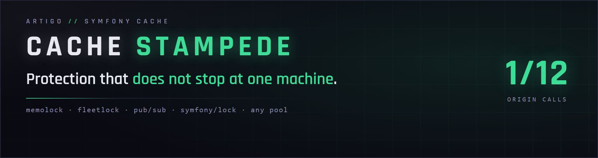
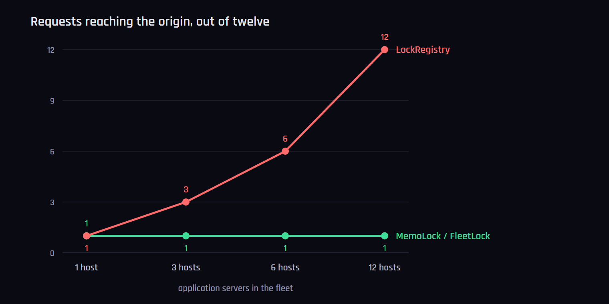
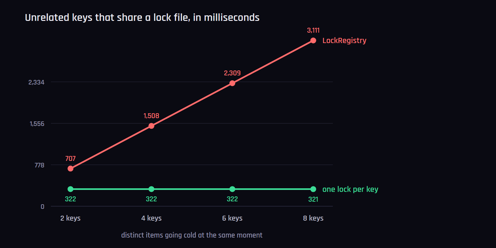

<p align="center">
	
</p>

**Stampede protection for `symfony/cache` that keeps a cold key to one origin call — on one server or on twelve.**

> **Its other half is [`artigo/versioned-cache`](https://github.com/artigo-dev/versioned-cache)**,
> a tag-aware Redis adapter whose invalidation costs four commands whether three
> items match or twenty thousand. This package keeps the herd off your origin;
> that one keeps the invalidation from being expensive in the first place.
> Neither depends on the other — see [Use them together](#use-them-together).

## The problem

Symfony guards against cache stampedes with `LockRegistry`, which `flock()`s a
fixed set of **local files**. Two consequences follow from "local" and "fixed",
and both are measured below.

**Local** means the protection stops at the machine. On a fleet of N application
servers a cold key reaches your origin **N times** — twelve servers, twelve
identical expensive queries arriving at one database together. The user-facing
wait is unchanged, which is why this is a deliberate trade-off; what scales with
the fleet is the load at the origin.

**Fixed** means a couple of dozen locks cover an unbounded keyspace — 24 files
on Symfony 8.1, 25 on 6.4 and 7.3, chosen by `abs(crc32($key)) % count($files)`.
Two unrelated items that land on the same file wait for each other, for a lock
that protects nothing they share.

## Installation

```bash
composer require artigo/cache-stampede
```

## Usage

```php
use Artigo\Cache\MemoLock;
use Symfony\Component\Cache\Adapter\RedisAdapter;

$pool = new RedisAdapter(RedisAdapter::createConnection('redis://127.0.0.1'));
$pool->setCallbackWrapper(MemoLock::fromDsn('redis://127.0.0.1'));
```

That is the whole integration. `setCallbackWrapper()` is a **public** method on
every Symfony adapter — no subclassing, no fork, no patched core — so this works
with any pool: Redis, filesystem, chained, tag-aware, your own.

[`examples/expensive-query.php`](examples/expensive-query.php) runs it — eight
processes released together on a key that has just expired:

```console
$ php examples/expensive-query.php
eight requests on a cold key, 400 ms to answer it

  waited   after   410 ms  ->  the report
  queried  after   408 ms  ->  the report
  waited   after   410 ms  ->  the report
  ... five more

the query ran 1 time(s) for 8 requests
```

One query, eight answers, and the seven that waited are served **2 ms behind**
the one that ran it.

### Why two classes

Both fix the same two things: the lock is visible to the whole fleet, and it is
named after the key rather than drawn from a fixed pool of files. On the
headline benchmark they are identical — **1 origin call out of 12, across 12
machines**. Neither is a cut-down version of the other.

They differ in one decision, and everything else follows from it: **what the
lock is made of.**

`FleetLock` takes a `symfony/lock` `LockFactory` and knows nothing else. It has
no Redis dependency of its own — no Redis class appears in the file — so it
locks on whatever store you already run. The cost is that the Lock component
has no way for a store to *announce* that a lock was released: with the
exception of Flock, Semaphore and the two PostgreSQL stores, a waiter finds out
by retrying on a **100 ms sleep**.

`MemoLock` speaks Redis directly, which lets a waiter block on a Pub/Sub channel
and be **woken by a message** the moment the holder is done. The price is Redis
only, and a **second connection** — a connection in subscribe mode cannot serve
anything else, so the subscriber cannot be the one holding the lock.
`fromDsn()` opens both for you; hand the constructor no subscriber factory and
it degrades to polling the lock key, which is `FleetLock`'s wake-up with
`MemoLock`'s API.

| | `MemoLock` | `FleetLock` |
|---|---|---|
| lock lives in | Redis, four plain commands | any `symfony/lock` store |
| a waiter is woken by | a Pub/Sub message | a 100 ms poll\* |
| overhead over a 300 ms origin call | **16 ms** | 134 ms |
| origin calls, 12 requests / 12 servers | **1** | **1** |
| connections | two, the second subscribing† | one |
| needs | `ext-redis` or Relay, Redis 8.4+ | `symfony/lock` |
| outside a cache pool | `exclusively()`, `once()`, `KeepAlive` | — |

\* except on the PostgreSQL stores, which block natively — fleet-wide *and*
woken immediately, without Redis anywhere.
† the subscriber is optional; without it `MemoLock` polls the lock key. Still
one origin call, just a slower wake-up.

**The 16 ms / 134 ms is not a backend difference.** Both numbers come from the
same run against the same Redis: the benchmark wires `FleetLock` as
`new FleetLock(new LockFactory(new RedisStore($redis)))`. What separates them is
only how the waiter finds out, message versus poll.

### Where each one fits

**Reach for `MemoLock` when** Redis is already in the stack, the wait a waiter
inherits is worth 100 ms to you, and a second connection is not a problem. It
is also the only one of the two that locks things that are **not cache items**
— a thumbnail, an import, a provisioned resource — through `exclusively()` and
`once()`, with a `KeepAlive` for work that outlives its own lock TTL.

**Reach for `FleetLock` when** any of these hold:

- there is no Redis, and the fleet-wide store is PostgreSQL, Doctrine DBAL,
  Memcached, Zookeeper — anything the Lock component supports;
- there *is* Redis, but you would rather have one lock abstraction across the
  application than a second, Redis-shaped one;
- you cannot spare the second connection a blocking `SUBSCRIBE` needs;
- the store is PostgreSQL, in which case the poll does not apply at all.

Running `FleetLock` on Redis is an ordinary choice, not a fallback — it is what
the benchmark measures. The only thing you give up is the wake-up latency.

```php
use Artigo\Cache\FleetLock;
use Symfony\Component\Lock\LockFactory;
use Symfony\Component\Lock\Store\RedisStore;

$pool->setCallbackWrapper(new FleetLock(new LockFactory(new RedisStore($redis))));
```

Both take the timings you would expect — how long the lock may be held,
how long a waiter waits before looking at the pool again — and both default to
something sensible:

```php
new MemoLock($redis, lockTtlMs: 30_000, waitTimeoutMs: 5_000);
new FleetLock($locks, ttl: 30.0);
```

### Without a cache pool at all

The same lock, for the thing a cache is not: a thumbnail, a generated file, a
provisioned resource. One caller produces it; the rest wait for **the thing**
rather than for the lock, and carry on the moment it exists.

```php
$thumbnail = $lock->once(
    'thumbnail:'.$id,
    exists: static fn (): ?string => is_file($out) ? $out : null,
    make: function () use ($source, $out): string {
        $this->render($source, $out);

        return $out;
    },
);
```

`exists` is asked **before** any lock is taken, so a caller arriving after the
work is done never touches Redis for one. Returning `null` means "not there
yet".

[`examples/thumbnail.php`](examples/thumbnail.php) runs that for real — four
processes released on a barrier, all asking for the same thumbnail:

```console
$ php examples/thumbnail.php
four requests for one thumbnail, 400 ms to render

  waited   after   416 ms  ->  artigo-thumbnail-example.txt
  rendered after   414 ms  ->  artigo-thumbnail-example.txt
  waited   after   416 ms  ->  artigo-thumbnail-example.txt
  waited   after   416 ms  ->  artigo-thumbnail-example.txt
```

One render, four answers, and the three waiters finish **2 ms behind** the one
that did the work — that is the message arriving, not a poll coming round. A
mutex would have handed the lock to each of them in turn and let each decide,
again, whether to render.

### A plain critical section

When the waiters want the lock rather than a result:

```php
$lock->exclusively('import:companies', function (): void {
    $this->importCompanies();
});
```

The wake-up pays here too, which is the reason this is worth having beside
[`symfony/lock`](https://symfony.com/doc/current/lock.html). Eight workers
holding a 200 ms section in turn, fully serialised either way:

| | total | handover cost over eight |
|---|---|---|
| `symfony/lock` | 1 719 ms | 119 ms |
| **`exclusively()`** | **1 609 ms** | **9 ms** |

**Unlike everything else here, this throws.** A cache that cannot take a lock
computes anyway, because a duplicated computation beats a failed request; a
caller who asked that two workers never run something at once would rather hear
that it did not run, so an unreachable lock or one that never frees is a
`LockUnavailable`.

### Work that outlasts the lock

The closure holding the lock is handed a `KeepAlive`. Call it as the work goes
and the expiry moves out by a full TTL each time, so a long import does not have
its lock run out underneath it:

```php
$lock->exclusively('import:companies', function (KeepAlive $keepAlive) use ($rows): void {
    foreach ($rows as $row) {
        $this->import($row);
        $keepAlive();
    }
});
```

`once()` hands one to its `make` for the same reason. Closures that do not want
it simply declare no parameter.

It **throws** if the lock has gone — expired, and taken by somebody else while
the work ran. That is the one thing a long section needs to hear, and a return
value is too easy not to read; `symfony/lock`'s `refresh()` throws for the same
reason. The extension is a single `SET … IFEQ` (Redis 8.4): it rewrites the
lock only while it still carries our token, so nobody else's lock is ever
touched.

**What `symfony/lock` still does better:** it **releases on destruct**, so a
process that `exit()`s or fatals mid-section hands the lock back at shutdown,
where a `finally` does not run at all. What that case costs here is the lock's
remaining TTL, which is also the longest a waiter will wait for it — and a
destructor is itself best effort, skipped on a hard crash.

### Per-call overrides

A slow resolver wants a lock that outlasts it; a cheap key is not worth locking
at all. Symfony's `get()` has nowhere to say either — its signature is
`($key, $callback, $beta, &$metadata)` and `$beta` governs probabilistic early
expiry, not locking — but `setCallbackWrapper()` hands back whatever it
replaced, so a single call can borrow a different lock and give it back.

```php
// a longer lock, for this call only
$value = $lock->with(lockTtlMs: 30_000)->around(
    $pool,
    static fn () => $pool->get('external-api', $resolver),
);

// no lock at all, for a key not worth protecting
$value = MemoLock::unguarded($pool, static fn () => $pool->get('cheap', $resolver));
```

`with()` answers a copy, so the lock the pool normally uses is untouched, and
the restoring happens in a `finally` — which is the part that gets forgotten
when this is written out by hand.

**Choosing the lock TTL:** set it to the longest the work should take. Too low
and the waiters see it expire and rebuild in parallel, which is the thing being
prevented; too high and a holder that dies keeps everybody waiting before one
of them retakes it.

## Measured, not asserted

`benchmarks/stampede.php` spawns real processes, releases them on a shared
wall-clock barrier, and counts how many reach the origin. Redis 8, PHP 8.4,
Linux.

### One cold key, twelve concurrent requests

| Setup | Origin calls | Overhead |
|---|---|---|
| no protection | 12 / 12 | 9 ms |
| `LockRegistry`, 1 app server | 1 / 12 | 107 ms |
| `LockRegistry`, 3 app servers | 3 / 12 | 114 ms |
| `LockRegistry`, 6 app servers | 6 / 12 | 110 ms |
| `LockRegistry`, 12 app servers | **12 / 12** | 9 ms |
| **`FleetLock`**, any fleet size | **1 / 12** | 134 ms |
| **`MemoLock`**, any fleet size | **1 / 12** | **16 ms** |

```bash
docker compose up -d
php benchmarks/stampede.php workers=12 resolverMs=300 hosts=12
```



`LockRegistry` gives **exactly one origin call per app server** — three hosts,
three calls; twelve hosts, twelve. Its lock files are local, so a second machine
cannot see them. Note the last row of its own block: twelve hosts looks *fast*
only because nobody is waiting for anybody.

### Different keys that happen to share a lock file

`LockRegistry` never locks the key. It locks one of a **fixed list of files** —
Symfony's own `Adapter/*.php` sources, opened for nothing but `flock` — picked
by `abs(crc32($key)) % count($files)`. The list is a constant, and its docblock
says what its length means: *"The number of items in this list controls the max
number of concurrent processes."* So one machine can compute **24 distinct keys
at once** on Symfony 8.1, and the 25th waits for work it has nothing to do with.

Distinct cold keys chosen to share a slot, 300 ms to compute each. All of them
genuinely need computing, so the lock saves nothing here and only lines them up:

| unrelated keys | `LockRegistry` | one lock per key |
|---|---|---|
| 2 | 0.707 s | **0.322 s** |
| 4 | 1.508 s | **0.322 s** |
| 6 | 2.309 s | **0.322 s** |
| 8 | 3.111 s | **0.321 s** |

```bash
php benchmarks/stampede.php workers=8 resolverMs=300 keys=collide
```



Strictly linear: eight items at 300 ms each take **3.1 seconds between them
instead of 0.3**, on a single machine, with no fleet involved. Eight keys are
well under that ceiling, which is the point: collisions arrive long before the
list is exhausted, birthday-style, and these are simply chosen to make one
visible.

Both locks here are named after the key itself — `$prefix.$item->getKey()` — so
there is no slot table to land in, no ceiling on how many distinct keys compute
at once, and two unrelated keys are never each other's problem.
`LockRegistry::setFiles()` will lengthen the list, but a longer list of local
files is still a list of local files.

## Notes worth knowing

- Setting the wrapper explicitly **also overrides Symfony's default of disabling
  locking under the CLI SAPI**, which is what makes any of this measurable from
  a script. Symfony also disables `LockRegistry` entirely on Windows; neither
  lock here does.
- **Probabilistic early expiration is not what these locks do**, and `$beta` is
  not read. Recomputing a little before expiry, at random, and hoping the herd
  never forms is the *other* answer to this problem — the answer these locks
  exist because of — and Symfony decides it upstream anyway, before the wrapper
  is ever called.
- **`INF` is honoured**, the way `LockRegistry` honours it: a forced recompute
  waits for the lock like any other waiter and then takes it. It arrives on the
  same parameter but means something explicit — recompute now — so it still
  gets you a value computed after you asked, and it gets it behind the lock
  rather than beside it.
- Neither lock will ever be the reason a request fails: an unreachable Redis or
  lock store degrades to computing without protection, and says so through the
  PSR-3 logger.
- **A waiter looks at the lock before every `SUBSCRIBE`** and listens 100 ms
  at a time. A lock that is already gone is not waited for at all, a lock
  about to expire is waited for about that long, and a wake-up that went out
  in the window before the subscription began - the holder was quick - costs
  one slice rather than the whole `waitTimeoutMs`. That slice is
  `LockRegistry`'s own poll granularity, so on a missed message the two are
  even; on a delivered one `MemoLock` is a millisecond behind the holder. The
  subscriber connection is opened once per lock instance and kept.
- **Waiters take a read lock.** Acquiring the exclusive one hands it over one at
  a time, and the last of twelve waits out eleven acquire/release cycles before
  it looks at the pool — measured at 486 ms against a 300 ms call, worse than no
  lock at all. `LockRegistry` avoids the same trap with `flock(LOCK_SH)`.

## Use them together

Invalidating a tag that matches twenty thousand items is one problem; twenty
thousand items going cold at once, on every server you have, is the next one.
[`artigo/versioned-cache`](https://github.com/artigo-dev/versioned-cache)
answers the first, this package answers the second.

```bash
composer require artigo/cache-stampede artigo/versioned-cache
```

```php
use Artigo\Cache\Adapter\VersionedRedisTagAwareAdapter;
use Artigo\Cache\MemoLock;
use Symfony\Component\Cache\Adapter\RedisAdapter;

$redis = RedisAdapter::createConnection('redis://127.0.0.1');

$pool = new VersionedRedisTagAwareAdapter($redis);
$pool->setCallbackWrapper(MemoLock::fromDsn('redis://127.0.0.1'));
```

Neither package requires the other, and the locks here improve any Symfony pool
at all — filesystem, chained, tag-aware, your own.

A worked example of the two together, which runs, lives in the other repository:
[`examples/together.php`](https://github.com/artigo-dev/versioned-cache/blob/main/examples/together.php).
It warms a handful of tagged cards, invalidates the tag they share and reads
them back, printing how often the origin was reached at each step.

## Requirements

PHP 8.2+ · `symfony/cache` 6.4, 7.x or 8.x · and then either `ext-redis`/Relay
and **Redis 8.4+** for `MemoLock`, or `symfony/lock` for `FleetLock`.

`MemoLock` is four plain commands and no script: `SET NX PX` takes the lock,
`SET … IFEQ` extends it while it is still ours, `DELEX … IFEQ` releases it on
the same condition, and `PUBLISH` wakes the waiters. The two conditional forms
are Redis 8.4, which is where the floor comes from.

CI runs the suite on PHP 8.2 to 8.5 against Symfony 6.4, 7.4 and 8.1, on
Redis 8.4 and the current 8.x, and through Relay.

## Benchmarks

Every number above is something you can re-run rather than take on trust:

| script | question it answers |
|---|---|
| `benchmarks/stampede.php` | how many requests reach the origin when a key goes cold, and what does waiting cost? |
| `examples/expensive-query.php` | eight requests, one cold cache key |
| `examples/thumbnail.php` | four requests, one file that has to be generated |

`keys=collide` switches it from one shared key to distinct keys that share a
lock file, which is the second table. `hosts=N` models a fleet by giving each
worker its own `LockRegistry` file set — which is what a separate machine is to
`flock`.

## Licence

MIT. See [LICENSE](LICENSE).
